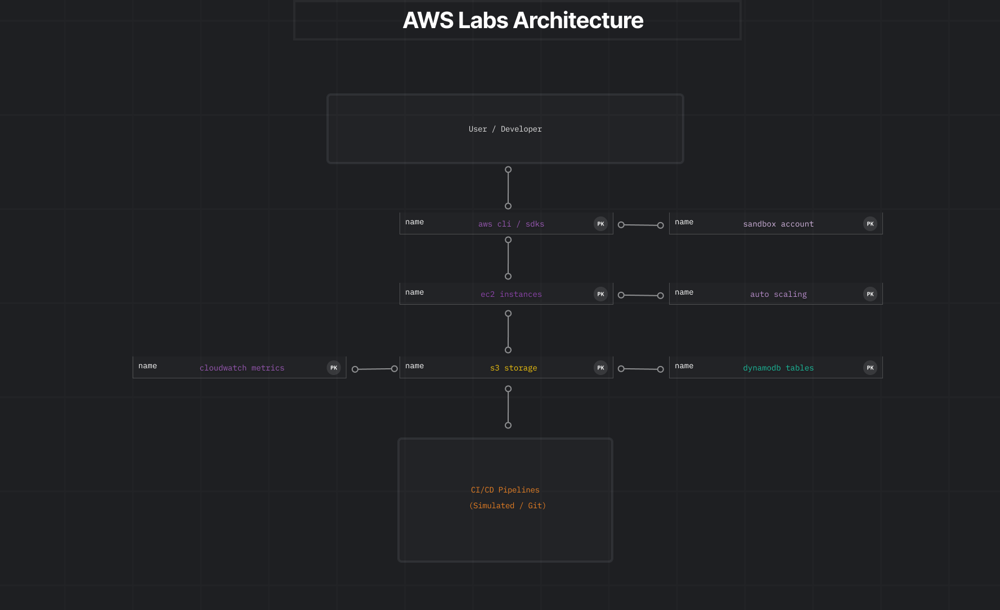

# AWS Labs

Welcome to the AWS Experimentation Lab.

Explore core AWS services and deploy sample applications safely.

---

### Lab Structure

```text
aws-labs/
 ├─ README.md
 ├─ cpp/
 │  └─ s3_latency_probe.cpp
 ├─ csharp/
 │  └─ AwsHealthCheck.cs
 ├─ cuda/
 │  └─ gpu_visibility_check.cu
 ├─ env/
 │  ├─ environment.yml
 │  └─ requirements.txt
 └─ python/
    ├─ diagnostics/
    │  ├─ aws_env_check.py
    │  └─ permissions_probe.py
    └─ pipelines/
       └─ github_actions_sim.py
```

- **cpp/** – AWS SDK for C++ examples.  
- **csharp/** – AWS SDK for C# examples.  
- **cuda/** – GPU verification scripts (optional).  
- **env/** – Python dependencies (`requirements.txt`) or Conda (`environment.yml`).  
- **python/diagnostics/** – Validate AWS environment and IAM permissions.  
- **python/pipelines/** – Simulated CI/CD pipelines.

---

## Project Structure

- `solutions/` – Documented technical solutions and experiments  
- `aws-labs/` – AWS-focused experiments  
- `azure-labs/` – Azure-focused experiments  
- `apps/` – Sample applications used for testing and validation  

---

## Maintainer

Maintained by **DakotaB75** as an independent open-source contributor.

This is a personal learning and experimentation project.  
There is no official support, SLA, or guaranteed stability.

---
## Support

If you find this project useful, consider supporting it via GitHub Sponsors.

---

## Thanks to our Sponsors

<a href="https://github.com/Crisfontana29" title="GitHub Sponsor 1">
  
</a>

<a href="https://github.com/Kohenkyo" title="GitHub Sponsor 2">
  
</a>

---

## License

This project is licensed under the MIT License.  
See the LICENSE file for details.
